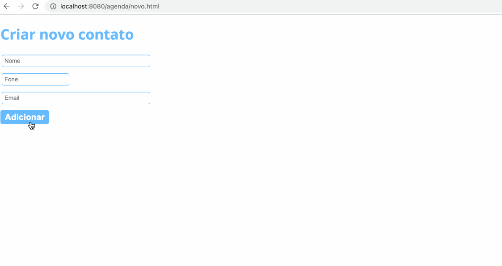

<h1>Agenda</h1>

<a href="https://github.com/dieegomr/agenda/blob/main/README_pt-BR.md">README.md</a> em português

This application consists of an agenda where it is possible to select, edit, delete and register contacts.

I developed this Java application for WEB using MVC, Servlet, JSP, JDBC, Tomcat and MySQL database.

<h3>Sample:</h3>

<h3>How to run this application?</h3>

 1) Clone the repository 

 	$ git clone https://github.com/dieegomr/agenda.git

 2) Open the project folder using an IDE like Eclipse for example;

 3) Create a MySQL database that contains columns: idcon (Primary Key), name, phone and email;

 4) In the DAO class inside the Model folder, assign values like username and password variables according to your database information;

 3) Run the project;

 4) Copy the localhost link provided by the IDE and paste it into your browser.

