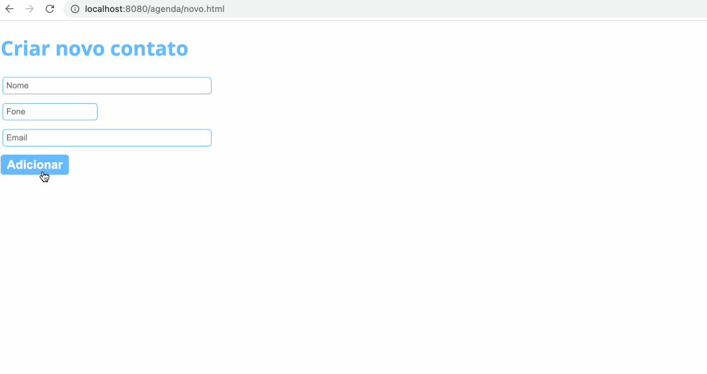

<h1>Agenda</h1>

<a href="https://github.com/dieegomr/agenda/blob/main/README.md">README.md</a> in English.

Esta aplicação consiste em uma agenda onde é possível selecionar, editar, deletar e cadastrar contatos.

Desenvolvi essa aplicação Java para WEB usando MVC, Servlet, JSP, JDBC, Tomcat e o banco de dados MySQL.

<h3>Amostra:</h3>

<h3>Como rodar esta aplicação?</h3>

 1) Clone o repositório 

     $ git clone https://github.com/dieegomr/PessoaWeb.git

 2) Abre a pasta do projeto usando uma IDE como Eclipse por exemplo;

 3) Crie um banco de dados MySQL contendo as colunas: idcon (Primary Key), nome, fone e email;

 4) Na classe DAO, dentro da pasta Model, atribuir valores as variáveis user e password de acordo com as informações do seu banco de dados;

 3) Click na opção rodar o projeto;

 4) Copie o link do localhost indicado pela IDE e cole no seu browser.
